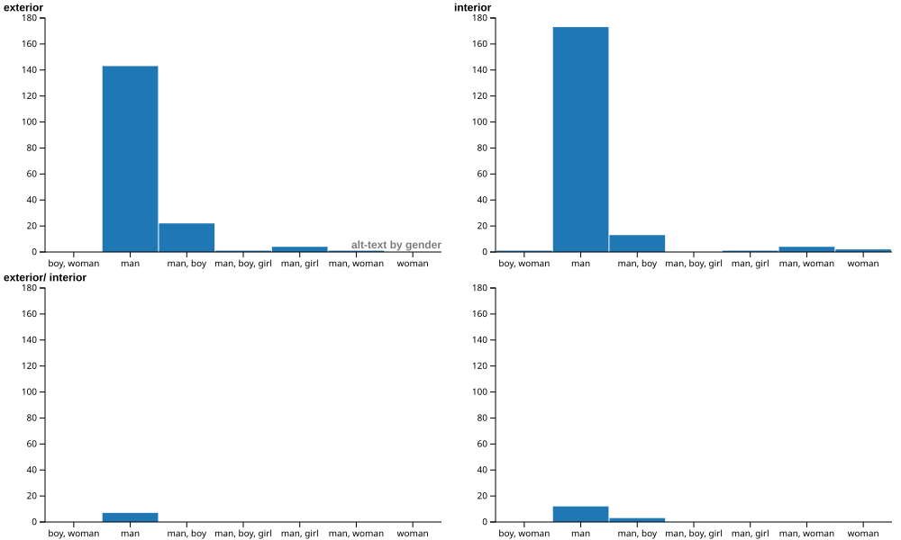

# Displaying (?) the Gendered Body: Gender Breakdown Comparisons by Shot Location and Tracking in Paul Thomas Anderson's Filmography

My mini project was created as a way to start thinking about the analytical potential of the PTAnnotated project's metadata, specifically the alt-text for each screenshot. While not driven by an incredibly clear vision, my goal here was to breech the massive subject of gender across the films of his I have seen (sans *One Battle After Another*). My first idea was to compare gender breakdowns by the shot location -- whether the shot was labeled "interior" or "exterior." This concept was based in my personal interest in ecofeminism and the relationship between gender and space (domestic vs public, wild vs man-made, etc). As an extension of this idea, I began also comparing the gender breakdowns of tracking shots. The general goal remains the same here: experiment with the data to see how gender is being shot, being captured, in the films. Including movement as part of my analysis is conceptually based in the thesis of a Classics Colloquium I attended in Freshman year titled "Allusion as Alluvium: Reading Helen's Liquid Commons," which, very basically, was interrogating how Helen -- in her story and imaginary existence -- moved, and consequently how allusion can be read as a geological process (which got into some ecofeminist ideas as well, but I digress). 

The products of this project are graphs for *There Will Be Blood*, *Punch-Drunk Love*, and *Boogie Nights* -- all of which deal with the metadata slightly differently. I went about the categorization of the gender breakdowns differently as I progressed, partially due to evolving methodology ideas and partially based on what I knew about each film. I purposefully chose to focus on films I had seen because I wanted to know the broader context beyond just the alt-text descriptions, even though I was just using the alt-text for the project itself.

## *Note on the "Gender Breakdowns" and the limitations of my data*

The extraction process for compiling the data on gender from the alt-text was incredibly subjective and inconsistent; this is because I a) made some singular decisions on particular alt-text descriptions and b) ran into trouble with my OpenRefine experimentation to automate the process. Each method of categorizing the gender breakdowns comes with its own faults and ommissions. *(expand on process and categorization here)*

## Graphs for *There Will Be Blood*

As the first graph I made (mostly as a barebones introduction to my idea), it lacks interactivity and much of an aesthetic appeal. It was also made before I shifted to comparing both location and tracking. However, this is the prototype-graph for my idea, how I initially wanted to see my comparison. As such, I am keeping it as my example graph from *There Will Be Blood* to show process. This particular film also yielded some of the least interesting results -- semi obviously, as the film is so intensely focused on a single man and his work in very male-dominated spaces. 

## Graphs for *Punch-Drunk Love*

As I began working on *Punch-Drunk Love*, I became much more focused on my actual methodology. I tweaked my categorization tactics for the gender breakdowns as well as how I was technically extracting/compiling such data in OpenRefine. The two below graphs were my initial visualizations for the data I compiled. 

<iframe src="https://kanaries.net/tool_component/share-embed?code=1VhLb%2BM2EP4rxhx6UlDH2Wx2dSkW7WVRtIfNopeFYUyksUyED5Uc2fEa%2Bu8FKdmmZDlOq02AnkzOUPPN2xzuIDM5QbqDzOilKPwqpyVWkj8VhaUCmXJI2VaUQEFGOUi%2FAVZsYJ5AZozN77eOSUEKBWmyIoMEpFCCIb26rhMgnZlc6MIF0UKRdsJoL2YHS5H77zbZYgoJaFQEKQiFBS1EDgk8oKNTqiOFmkX2dVt6jjZKaJSQAGqU2yPjAAZ1EmNdH7GWQjYAHayIOhZr1sFSJzjqB2C8O2KwUOQYVdkFislj0W6PaCh5wfTEXbCIOhbr%2FRGrIJ2TnTxYwsfcbHQXc4A7FvuuY%2BeVtyiZKNInxnZYY1E%2FDKFuzDO4e%2BZY5I8Rsi5kryT2pNG1FxV6LhyjznpIEXU0WFTp0mTI%2FkgHLKKOBotKXZk1KdK9woioo8Fuopq3mD0KXfzSq%2FmIPBouajFSFCsWuug58kgdDRZ1mMyo0jhxGrguYzRk1Gjyyg4kSkQdDRZ1Fl6RItcL3J42GihqJhmWXFnKFw%2FbniM7jNGQURf5QphvJ2wmqLVhZOol6CB%2F9P%2FtNG5jjdxTo3uccaALRbh4pO1iGW4nLcQfhK6yNPFb95yos%2FD1PAHVSOnflqLqdxnpXgfdk3qQraxTwL8rv2NksQ6fFcWfraBK9d0bddSqlAbzAe92Ga%2Bhxax%2FW1SoxZIcD90ZI95r6BLForTkSHNoFGdUOnfkNTR714%2FVwndNSUxD8YqZr6HN7XBhzs5X5uw1NFlkptLcrdUvZjMJ5B8FmIT%2FpyoanejJRz4UfLoDU0IKJhRpiRbDUDVPAF1fxfqk0axRDjeaNcpqqNP8R5fNE7Bm0208%2FzffhQlVVupk2nzTi%2BEbDzGN0cY2bjElZoK3zcaJ79SuVli2S4u5qFon8ooYm6U0uhBc5e0piRztCjKf82aZE6OQ7fdLIZls39tv64AEbCXDiwbvv%2BGJ8PRQIf75Qv%2BMMK%2FfdFZ4gVZeJR8DPzqn3%2Ba1d%2FrWVOw%2Fciuz%2BZRx83CyROkoCbSv%2BCDpvlIK7fbIYMwefTWF3wSEZrKY%2BWq7z9Br0R78Tta0lKbSmgTZgQpvQs0zTwIbkfMK0pvZNIEV%2BYs%2BpLPptE5gaaxCr2AdcuJ32nrLmpcTS87IdRD3dEA8KtnmaLs7pOnBtpCf%2B11QK2xqL9hnCVlIYU0FXknBBHUCa%2BE%2BHxrl%2Bq9jOH9doeXJtT%2BT%2BeVvGJJ8t4972nhIGAtJm7ApOOEn3olCHYjHvrLwTSq9vrv1%2BXOQQE%2F%2FVsLdh0sCFOrJT36%2BPyPh4ws1OC%2FhpiNhwAuqkixKbwWd8cP0ohWXRMxeLKHpD25YkYumXPDm7cud8awe7y%2BJuRyV6Ys12T%2F%2BDIV2Xv8D"></iframe>

<iframe src="https://kanaries.net/tool_component/share-embed?code=1VhLj9s2EP4rxhx60qJr7yOJLkHQXoKiPSRBL4FhzEpjmVg%2BVHJkr2PovxekZJuS5awbZRfoyeQM9X0zw5kxyR1kJidId5AZvRSFH%2BW0xEryh6KwVCBTDinbihIoyCgH6VfAig3ME8iMsfnnrWNSkEJBmqzIIAEplGBIr6Z1AqQzkwtduAAtFGknjPYwO1iK3H%2B3yRbXkIBGRZCCUFjQQuSQwAM6OpU6UqhZZF%2B2pddoo4RGCQmgRrk9Kg5kUCcx1%2FTItRSyIehwRdKxXLMOlzrhUT%2BB4%2FbIwUKRY1RllygWj2W7O7Kh5AXTE3fJIulYrvsjV0E6Jzt5sISPudnoLueAdiz3m46fV96jZKJInzjbUY1lfTvEujHf4d0rxzK%2Fi5h1IXslsReNrr2o0HPhGHXWY4qko8miSpcmQ%2FZLOmSRdDRZVOrKrEmR7hVGJB1NdhPVvMXsUejifa%2FmI%2FFouqjFSFGsWOiiF8ijdDRZ1GEyo0rjxOnGdRWjKaNGk1d2IFEi6WiyqLPwihS53sbtZaOJomaSYcmVpXzxsO0FsqMYTRl1kU%2BE%2BXbCZoJaG0amXoIO6kf%2F317HbazBPXW6pxlHulCEi0faLpbhdNJS%2FEnoKksTP3XfgzpLX88TUA1K%2F7QUVb%2FLSPc66F7Uo2yxTgn%2FqfyMkcU6fFYUf7VAleqHN%2BqoVSkN5gPR7SpewopZ%2F7SoUIslOR46M0a6l7Al2ovSkiPNoVGcMenckpew7La%2FVwvfNSUxDe1XrHwJa%2B6GC3N2vjJnL2HJIjOV5m6tfjKbSRD%2FLMIk%2FD9V0dWJnvzOh4JPd2BKSMGEIi3RYrhUzRNA1zexPmk0a5TDjWaNshrqND8YsnkC1my6jef%2FFrtwQ5WVOrltvvLx6ZWvMY3bxjaBMSVmgrfNxIlv1I5WWLZDi7mo2jDyihiboTS6EFzl7SqJHM0KMh%2FzZpgTo5Dt90shmWw%2F3q8bgARsJcObBu%2B%2F4Ynw8lAj%2FgFD%2F4owr1%2F1tnCBVd4kvwf%2B8px%2Bndc%2B6FtTsf%2FIrczmQ8bN08kSpaMkyL7gg6TPlVJot0cFY%2Fbo6yn8JiA0k8XM19vnDL0V7cJvZE0raWqtSZAdqPAq1Dz0JLAROa8gvZldJ7Aif9SHdHZ9XSewNFahN7AOOfEHbb1nzduJJWfkOsA9HRiPRrY52s4OaXrwLeTnfhbMCpPaA%2FssIQsprKnAKymYoE5gLdzHQ6tc%2F33czt9WaHky9WsyP%2FwdQ5Lv9s2g2Yx9yUPSJm0KTvh770ShDsJjd1n4VpVOZ%2Fc%2Bhw4oP4Lw5jkEhXryi7%2Fmn4G4ue0gnPHkOZTZ2ws9OQ8xfRZCVZJF6cNBwxDvLkZoOoUbNmR6UUQugbr%2FT0jn3Lq5BOX5%2BN5dHJ39o9CQKfP6Xw%3D%3D"></iframe>

I returned to my data for this film post working on *Boogie Nights* and re-made my graphs using the same excel data anaylsis + Flourish tool process. 

<noscript></noscript>

## Graphs for *Boogie Nights*

<noscript></noscript>

## Bibliography
